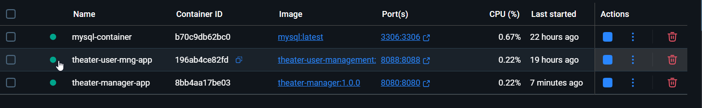

# Pasos para Despliegue en Docker

## Crear una Red para que los cotainer se vean entre si 
    docker network create theater-app-network

## Crear el contener de MYSQL y asociarlo a la red

    docker run --name mysql-container -e MYSQL_ROOT_PASSWORD=root -p 3306:3306 -v C:\Users\zurit\OneDrive\Escritorio\Gustavo\Database\MySQL -d mysql:latest

    docker network connect --alias mysql-db theater-app-network mysql-container

## Generar la imagen y desplegar el servicio de autenticacion asociado a la red creada 

    docker build -t theater-user-management:1.0.0 .

    docker run -d --name theater-user-mng-app --network theater-app-network -p 8088:8080 theater-user-management:1.0.0

## Generar la imagen y desplegar el servicio de administracion del teatro asociado a la red
  
    docker build -t theater-manager:1.0.0 .

    docker run -d --name theater-manage-app --network theater-app-network -p 8080:8080 theater-manage:1.0.0

### De esta forma quedaran los contenedores levantados y asociados a una misma red para que puedan interactuar.

