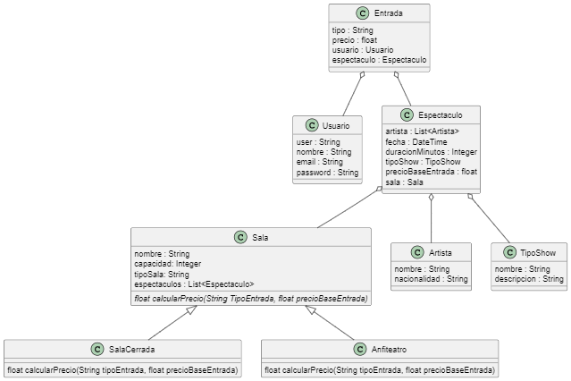

# TP Integrador de Tecnicas Avanzadas de Programación
Repositorio de Gustavo Zurita para el TP de la materia Tecnicas Avanzadas de Programacion de la UP.
## Enunciado
Una pequeña sala de teatro independiente requiere que se gestione la venta de entradas para sus espectáculos. Cuentan con dos espacios una sala con capacidad para 70 personas y un anfiteatro a cielo abierto con una capacidad para 120 personas. La primera posee un costo variable en las entradas, las tipo A, tienen un costo del doble de las tipo B. El anfiteatro tiene precio único.

Para lo cual un usuario registrado en el sistema registra la siguiente información:

    Artista
    Fecha de la función
    Hora de la función
    Sala
    Precio de la entrada
    Duración
    Tipo de show (infantil, musical, obra de teatro)

En el proceso de carga se debe validar que no se superpongan los espectaculos en una misma fecha y hora, para permitir la carga de espectaculos un mismo día, debe haber una hora libre en la sala para su limpieza previa al inicio del proximo show

El sistema debe poder mostrar los espectaculos próximos a presentarse en la sala, así como los anteriores, en este ultimo caso por supuesto no debe poder permitir realizar la compra de entradas.

## Indice

1. [Diagrama de Clases del Sistema](#diagrama-de-clases-del-sistema)
2. [Modelo de Datos](#modelo-de-datos)
3. [Tecnologias a Utilizar](#detalle-de-las-tecnologías-a-utilizar)
    1. [Desarrollo](#desarrollo)
        1. [Justificacion](#justificacion)
    2. [Persistencia](#persistencia)
        1. [Justificacion](#justificacion-1)
4. [Modulos a Testear](#modulos-a-testear)
## Diagrama de clases del sistema.



<details>
<summary ><strong> Ver Codigo PlanTUML</strong></summary>

```yaml
@startuml
Sala <|-- SalaCerrada
Sala <|-- Anfiteatro
Entrada o-- Usuario
Entrada o-- Espectaculo
Espectaculo o-- Sala
Espectaculo o-- Artista
Espectaculo o-- TipoShow

class Usuario {
  user : String
  nombre : String
  email : String
  password : String
}

class Espectaculo {
   artista : List<Artista>
   fecha : DateTime
   duracionMinutos : Integer
   tipoShow : TipoShow 
   precioBaseEntrada : float
   sala : Sala
}
class TipoShow {
    nombre : String
    descripcion : String
}

class Artista{
    nombre : String
    nacionalidad : String
}

class Sala{
    nombre : String 
    capacidad: Integer
    tipoSala: String
  espectaculos : List<Espectaculo>
  {abstract} float calcularPrecio(String TipoEntrada, float precioBaseEntrada)
}
class SalaCerrada {
  float calcularPrecio(String tipoEntrada, float precioBaseEntrada)
}
class Anfiteatro{
  float calcularPrecio(String tipoEntrada, float precioBaseEntrada)
}
class Entrada{
  tipo : String
  precio : float
  usuario : Usuario
  espectaculo : Espectaculo
}

@enduml
```
</details>

[Descargar el código PlantUML](diagrams/classDiagram.wsd)

[Volver al índice](#indice)


## Modelo de datos.


<details>
<summary ><strong> Ver Codigo PlantUML</strong></summary>

```yaml
@startuml

Entrada "0..*" --> "1" Usuario : compra
Entrada "0..*" --> "1" Espectaculo : vende
Artista "1"--> "0..*" Espectaculo_Artista : actua
Espectaculo "1"--> "0..*" Espectaculo_Artista : tiene
Sala "1" --> "0..*" Espectaculo : aloja
TipoShow "1" --> "0..*" Espectaculo : tiene

class Usuario {
  id_usuario : int
  usuario : String
  nombre : String
  email : String
  password : String
}

class Espectaculo {
    id_espectaculo : int 
    fecha : DateTime
    duracion_Minutos : Integer
    id_tipo_show : int 
    precio_base_entrada : float
    id_sala : int
}
class TipoShow {
    id_tipoShow : int
    nombre : String
    descripcion : String
}
class Sala{
    id_sala : int
    nombre : String 
    capacidad: Integer
    tipo_sala: String
}
class Entrada{
    id_entrada: int
    tipo : String
    precio : float
    id_usuario : int
    id_espectaculo : int
}
class Artista{
    id_artista : int
    nombre : String
    nacionalidad : String
}
class Espectaculo_Artista {
    id_espectaculo : int
    id_artista : int
}

@enduml
```
</details>

[Descargar el código PlantUML](diagrams/DataModel.wsd)

[Volver al índice](#indice)

## Detalle de las tecnologías a utilizar.

### Desarrollo 

La tencnologia que voy a estar utilizando para el desarrollo de este sistema va a ser Java, principalmente con el framework de SpringBoot para generar las APIs que necesite. 

#### Justificacion

- #### Framework
     Spring Boot es un framework muy adecuado para el desarrollo rápido de aplicaciones. Permite configurar y poner en marcha una aplicación web de manera rápida y sencilla 
- #### Escalabilidad 
    Spring Boot es conocido por ser altamente escalable, lo cual es crucial cuando se trata de una aplicación de gestión de espectáculos que potencialmente podría crecer y tener un mayor volumen de tráfico.
    Tambien permite el enfoque de microservicios lo que facilita la distribuciones y aislamiento de funcionalidades
- #### Manejo de Persistencia 
    Spring Data JPA es un módulo de Spring Boot que facilita la integración con bases de datos relacionales, usando Hibernate como proveedor de JPA hace más facil la integracion con Bases de Datos relacionales.
- #### Testing
    Spring Boot también soporta pruebas automáticas (unitarias e integración) de manera simple, lo cual mejora la calidad y mantenimiento del código a medida que la aplicación crece.
- #### Seguridad 
    Podria implementar SpringSecurity para mecanismos de autenticación y autorización de manera fácil y segura. 
- #### Preferencia Personal
    Finalmente, en lo personal, me siento mas comodo trabajando con esta tecnologia, lo cual me va a servir para ir corrigiendo y mejorando la implementacion a medida que vayamos avanzando en el proyecto. Por este motivo tambien lo plantee como una solucion con APIs sin FrontEnd. 

### Persistencia
   Para el modelo de datos, voy a hacer uno de una base relacion SQL. En este caso , voy a estar implementandolo en MySQL 

   #### Justificacion

   - #### Relacionalidad 
        MySQL es una base de datos Relacional, lo cual me va permitir manejar las relaciones entre las entidades de forma sencilla
   - #### Rendimiento
        MySQL permite manejar una gran cantidad de datos y consultas en simultaneo. Tambien es bastante optimo para consultas que requierean de Joins o sean complejas que me va a dar facilidad para reporting.
   - #### Facilidad de Integracion
        Con Spring Data JPA se puede integrar de manera rapida y sencilla. 
   - #### OpenSource
        Al ser libre, no requiero de licencias adicionales y hay una comunidad bastante activa por cualquier problema que pueda tener.
   
[Volver al índice](#indice)

## Modulos a Testear.
Los modulos que voy a estar cubriendo con las pruebas para cuplir con todos los puntos del enunciado van a ser 

1. #### Módulo de Autenticación y Gestión de Usuario (UsuarioService)

    **Responsabilidad** : Gestión de usuarios, registro, inicio de sesión, validación de credenciales.

2. #### Módulo de Seguridad (Autenticación y Autorización)

    **Responsabilidad**: Garantizar que los usuarios solo accedan a lo que se les permita (por ejemplo, solo los usuarios registrados pueden comprar entradas).

3. #### Módulo de Gestión de Entradas

    **Responsabilidad** : Gestión de entradas, compra de entradas, validación de disponibilidad, Cálculo de precios de las entradas, dependiendo del tipo de entrada y del tipo de sala.

4. #### Módulo de Gestión de Espectáculos

    **Responsabilidad** : Registrar espectáculos, validar superposiciones de horarios y asegurar que se puedan gestionar correctamente.

5. #### Módulo de Gestión de Sala

    **Responsabilidad**: Gestión de salas, validación de disponibilidad, cálculo de precios, etc.

[Volver al índice](#indice)
